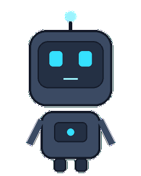
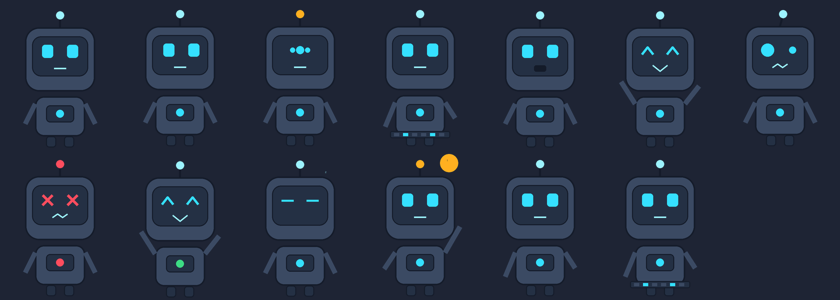

> **Branch `EXPERIMENTAL` — unstable work.** See [docs/BRANCH.md](docs/BRANCH.md).

EN | [FA](docs/README_FA.md) | [RU](docs/README_RU.md) | [CN](docs/README_CN.md) | [ID](docs/README_ID.md) | [KO](docs/README_KO.md)

## Brok 🤖 — Persian-first AI desktop companion & coding agent



Brok is a small robot that lives on your desktop (frameless, always-on-top, draggable), chats with you in
**Persian first** (English and other languages too), and can work as a **permission-controlled coding agent**
on your projects. It is a derivative of [myCat](https://github.com/yumiaura/myCat) — see [NOTICE](NOTICE) and
[LICENSE.txt](LICENSE.txt).



> **Status: alpha (0.2.0).** Developed and tested on Linux. Windows 10+ and macOS should work but are not yet
> verified; Windows 7 is not supported (Qt 6). Please report problems in the issue tracker.

### What it can do
- **Robot avatar** with 13 states (idle, listening, thinking, typing, coding, working, speaking, happy, confused,
  error, success, sleeping, notification), state-driven; extra avatar packs via `pack.json`.
- **Chat** with **Claude**, **Ollama (local)** or any OpenAI-compatible API; the UI shows **LOCAL AI / CLOUD AI**.
- **Coding workspace** (right-click → *Coding Workspace…*): file explorer, editor, AI chat, diff viewer,
  terminal, problems, git, project info. Select code → *Explain / Find bug / Optimize / Write tests / To Flutter*.
- **Agent with safety rails**: every tool has a risk level; edits show a diff first; delete/commit/push and risky
  commands always ask; dangerous commands are blocked; hard limits on steps, time, tokens and tool calls.
  See [docs/security.md](docs/security.md).
- **Persian + RTL** interface, Persian explanations with English code, learning mode, AI debugger, project health report.
- **Memory you control** (view/edit/delete/clear), privacy report, local-only/offline mode, plugin API.
- Everything from myCat: reminders, activity diary, focus timer, GitHub notifications, calendar, custom characters.
- Terminal agent: `brok-agent ask|code|fix|debug|learn|health|doctor|privacy|memory`.

**Honest status:** the core (providers, tools, permissions, agent loop, memory, index, avatar, workspace UI, hotkey,
vision attach, assistants) is covered by automated tests that pass on Python 3.8 and 3.12 (Linux, headless), and the new
modules pass `mypy --strict`. Not verified by the authors: real Claude/OpenAI/Ollama/GitHub calls with live keys,
Windows/macOS builds, a physical display, microphone speech-to-text (only the interface + OS text-to-speech exist).

## 🚀 Quick start (Python ≥ 3.8)

```bash
pip install .                 # or: pip install ".[secure,calendar]"
brok                          # desktop companion
export ANTHROPIC_API_KEY=...  # optional, for Claude  (or use Ollama: ollama pull llama3.1)
brok-agent doctor             # check providers
brok-agent --project . ask "این پروژه چه کاری انجام می‌دهد؟"
```
Python 3.8 uses PySide6 6.6.3 / Pillow 10.4 (see [docs/PYTHON_COMPATIBILITY.md](docs/PYTHON_COMPATIBILITY.md));
3.8 is end-of-life, prefer 3.10+ when you can. More: [configuration](docs/configuration.md),
[architecture](docs/architecture.md), [AI](docs/ai.md), [coding agent](docs/coding-agent.md),
[privacy](docs/privacy.md), [plugins](docs/plugins.md), [development](docs/development.md),
[troubleshooting](docs/troubleshooting.md).

## 🎮 Usage
`brok --image path/to/char.zip` (custom char), `--pos X Y`, `--wait SECONDS`, `--debug`.
Left-drag to move, right-click for the menu. Settings live in `~/.config/brok/` (a legacy `~/.config/mycat` is
copied once, never deleted).

## 🐳 Docker

Run the cat in a container with GUI forwarding to your host's X server.

**Prerequisites:** Docker, and an X server on the host (Xorg on Linux, VcXsrv on Windows, XQuartz on macOS).

```bash
# Linux
xhost +local:docker
docker compose up --build

# Windows (VcXsrv running, network clients allowed)
docker compose -f docker-compose.windows.yml up

# macOS (XQuartz running, network clients allowed)
docker compose -f docker-compose.mac.yml up
```

## 🔧 Troubleshooting

**Cat appears in a black box / transparency doesn't work** 🫥
- On X11 transparency needs a compositor. brok falls back to clipping the window to the cat's outline when none is running, so this is rare; if you still see a box, enable display compositing (XFCE: *Window Manager Tweaks → Compositor*) or run a compositor such as `picom`.

**Window doesn't stay on top / doesn't show in the taskbar** 📌
- Some window managers override "always on top" - restart the desktop session or check the WM settings.

**Custom char doesn't load** ❌
- The ZIP must contain exactly one valid `.gif`. Check the path and that the file isn't corrupted.

**Position not saving** 💾
- Make sure `~/.config/brok/` exists and is writable; the config file is `~/.config/brok/config.ini`.

**Windows / launch issues** 🪟
- Need Python ≥ 3.10 (`python --version`) for the pip install, or just use the prebuilt `.exe`.
- From the repo you can also launch with `run.bat` (Windows) or `run.sh` (Linux/macOS).
- Verify PySide6: `python -c "import PySide6; print('PySide6 OK')"`.

**Permission errors** 🔒
- On Linux prefer a user install over `sudo` (`pip install --user brok`).

### 🤝 Getting help

- Search the [GitHub Issues](https://github.com/Barman-Zarei/Brok/issues) for similar problems.
- Read [CONTRIBUTING.md](CONTRIBUTING.md) for development setup.
- Open a new issue with your OS, desktop environment, Python version and any terminal errors.

### License & attribution

[MIT License](LICENSE.txt)

Thank you for reading to the end! 😸🐾

<p class="badges">
</p>

Brok is based on myCat (© 2025 @yumicabrera, MIT CAT LICENSE / Meow-IT). Original Brok code © 2026 Barman. See NOTICE.
